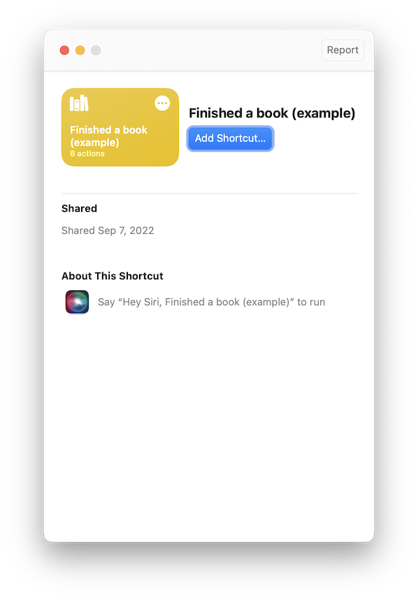

# Finished a book shortcut

Download the [Finished a book shortcut](Finished%20a%20book.shortcut) to quickly create GitHub issues for the action.

## Set up

When you first open the shortcut, it will ask you to enter your GitHub repository and a GitHub token.

## Using the shortcut

1. After you finish a book, click the _Finished a book_ shortcut from the Shortcuts app.
2. The shortcut will ask you for the book ISBN, the date you finished the book, and any notes (optional).
3. Finally, the action will automatically create and open a GitHub issue.
